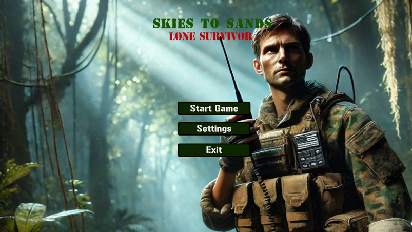
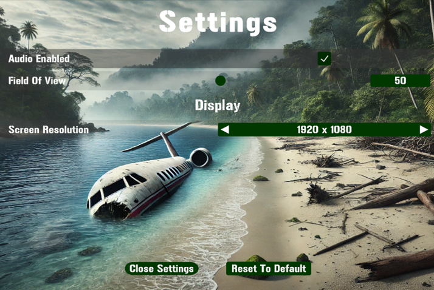
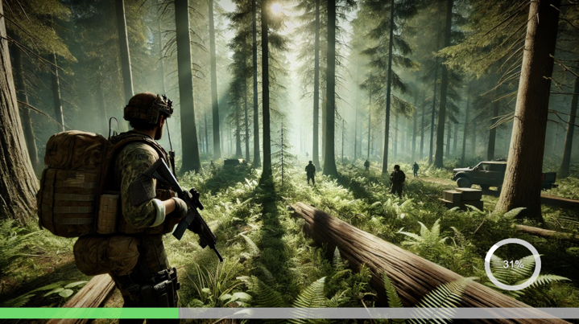
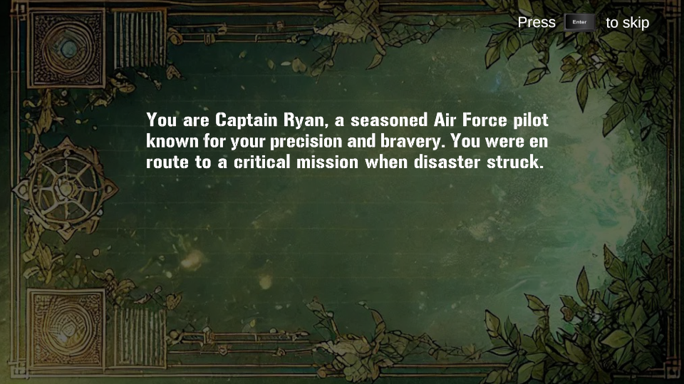
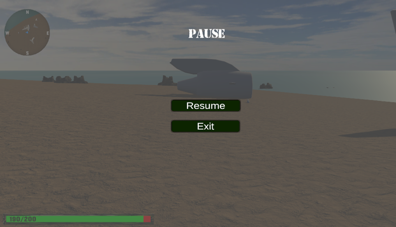
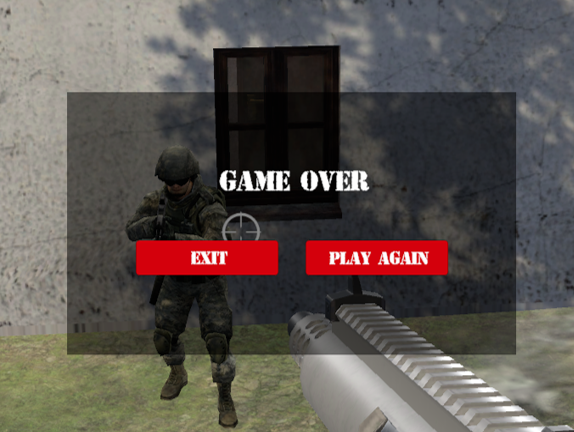
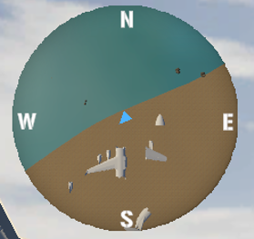

# Skies to Sands: Lone Survivor - A Unity 3D Survival Adventure

Welcome to **Skies to Sands: Lone Survivor**, a thrilling open-world survival adventure game built in **Unity 3D**. Step into the shoes of **Ryan**, a pilot who crash-landed on a **remote and perilous island**. With danger lurking at every corner—ranging from wild animals to hostile soldiers—your mission is clear: **stay alive, locate a military base, find a radio, and call for rescue.**

Do you have what it takes to **outsmart the enemy**, **scavenge for supplies**, and **escape this island alive**?

---

## Table of Contents
- [Game Overview](#game-overview)  
- [Game Features](#game-features)  
- [Installation](#installation)  
- [Running the Game](#running-the-game)  
- [Controls](#controls)  
- [Game Analysis](#game-analysis)  
- [In Game Photos](#in-game-photos)  
- [Game Walkthrough](#game-walkthrough)  

---

## Game overview

**Skies to Sands: Lone Survivor** offers an immersive survival experience where every decision matters.  
As Ryan, a **stranded pilot**, you must navigate the **dense forests, rugged cliffs, and abandoned structures** of an island that hides a dark secret.

### **The Ultimate Goal:**  
- **Survive** by collecting resources, crafting weapons, and staying alert.  
- **Avoid or engage enemies**—your choices determine your fate.  
- **Find the secret military base** to **retrieve a radio and call for help**.  
- **Make it out alive!**  

This is **not just a game**—it's a battle for survival. Will you be the **lone survivor**, or will the island claim you?  

---

## Game features  

- **Open-World Survival:** Explore an **expansive island** filled with **danger, mystery, and hidden secrets**.  
- **Combat & Stealth Mechanics:** Engage in **intense firefights** with enemy soldiers or **sneak past guards** unnoticed.  
- **Dynamic Wildlife System:** Beware of wolves and hunt small animals for **food and crafting materials**.  
- **Interactive Minimap:** Displays **terrain, points of interest, and threats** for better navigation.  
- **Inventory & Resource Management:** Manage your **weapons, ammo, medkits, and food** wisely.  
- **Engaging Narrative & Storytelling:** Unfold a **fully developed lore and backstory** as you explore.  
- **Replayability & Multiple Playstyles:** Choose your strategy—**stealthy survivalist or fearless warrior**.  

---

## Installation  

### **Option 1: Running from Source (Unity Engine Required)**  
1. **Clone this repository** to your local machine using Git:  
   ```bash
   git clone https://github.com/vasilisanagno/Skies-to-Sands-Lone-Survivor-Game-Unity-3D.git
   ```  
2. **Open the project in Unity** (Unity 2021+ recommended).  
3. **Build the game** via the Unity Build Settings panel.  
4. **Run the game** and start your survival adventure.  

### **Option 2: Running the Prebuilt Game (No Unity Needed)**  
1. **Download the `Game` folder** from the repository.  
2. Locate the executable file:  
   - **Windows:** `SkiesToSandsGame.exe`  
   - **Mac:** `SkiesToSandsGame.app`  
   - **Linux:** `SkiesToSandsGame.x86_64`  
3. Double-click the game file to **launch the game**.  

---

## Running the game  
- If you downloaded the **built version** (`Game` folder), simply **run the `.exe` file**.  
- If you're running from Unity, **click "Play" in the Unity Editor** to start.  

---

## Controls  

| Action                 | Key |
|------------------------|-----|
| Move                  | `W, A, S, D` |
| Jump                  | `Space` |
| Sprint                | `Shift` |
| Fire Weapon           | `Left Mouse Button` |
| Interact with Objects | `E` |
| Open/Close Inventory  | `I` |

---

## Game analysis  

For a **deeper look** into the mechanics, features, and game design, refer to the **Game Design Documentation**:  

📊 **[Game Design Overview - .pptx](Final%20Presentation.pptx)**  

---

## 📸 In game photos










---

## Game walkthrough - Watch It in Action!  
**Check out the official gameplay demo here:**  
[**Watch the Gameplay Demo**](https://www.youtube.com/embed/EUUESBDZUpU)  
